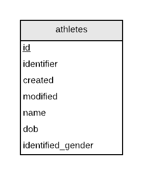
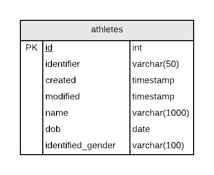

# Leader Board

## Sommaire

| Sommaire | Valeur |
| --- | --- |
| Cours | CSI 2532 |
| Date | Winter 2020 |
| Professor | [Andrew Forward](aforward@uottawa.ca) |
| TA 1 | [Kyle Quintal](kquin039@uottawa.ca) |
| TA 2 | [Lintian Wang](lwang263@uottawa.ca) |
| Equipe | Andrew Forward 1484511<br>Ayana 9021000 |

## Livrables

### Livrable 1 (5%) Hello-World

| Note | Description | Commentaire |
| --- | --- | --- |
| 2.0 | Configuration du repo GitHub | [GitHub Repo](https://github.com/aforward/leaderboard) |
| 2.5 | Modèle ER | Voir ci-dessous |
| 2.5 | Modèle relationnel / schéma SQL | Les images et SQL ci-dessous |
| 1.0 | Exemples SQL pour insérer, mettre à jour, sélectionner et supprimer des données | Voir les exemples ci-dessous|
| 1.0 | README.md contient toutes les informations requises | Voir _cette_ page |
| 1.0 | Utilisation de git (messages de commit, tous les étudiants impliqués) | Voir [les commits dans GitHub](https://github.com/aforward/leaderboard/commits/master) |
| / 10 | |

## Description de l'application

La base de données du leaderboard doit modéliser un athlète, y compris
des détails tels que leur nom, leur date de naissance et leur sexe.

## Modèle ER

Le diagramme ER a été créé avec [Lucidchart](/lucidchart.md).



## Modèle relationnel

Le modèle relationnel (diagramme) a également été créé avec [Lucidchart](/lucidchart.md).



## Schéma SQL

Cela a été testé avec [Online SQL Interpreter](https://www.db-book.com/db7/university-lab-dir/sqljs.html)
dans le [manuel](https://www.db-book.com/db7/index.html).

```sql
CREATE TABLE athletes (
  id int,
  identifier varchar(50),
  created timestamp,
  modified timestamp,
  name varchar(50),
  dob date,
  identified_gender varchar(6),
  PRIMARY KEY (id)
);
```

## Exemples de requêtes SQL

Après avoir exécuté le schéma, vous pouvez tester les requêtes
dans [Interpréteur SQL en ligne](https://www.db-book.com/db7/university-lab-dir/sqljs.html)
"Refresh" le navigateur pour recommencer.

```sql
INSERT INTO athletes (id, name, identified_gender, dob)
VALUES
(1, 'Andrew', 'm', '1975-12-01'),
(2, 'Ayana', 'F', '1998-06-11'),
(3, 'Hayden', 'm', '1996-07-24'),
(4, 'August', 'm', '1999-09-09');
```

Trouvez tous les athlètes «F»

```sql
SELECT *
FROM athletes
WHERE identified_gender = 'F';
```

Mettez à jour tous les «m» à «M».

```sql
UPDATE athletes
SET identified_gender = 'M'
WHERE identified_gender = 'm';
```

Et maintenant, tous les athlètes «M»

```sql
SELECT *
FROM athletes
WHERE identified_gender = 'M';
```

Supprimons tous les athlètes.

```sql
DELETE FROM athletes;
```

Et maintenant c'est vide.

```sql
SELECT count(*)
FROM athletes;
```