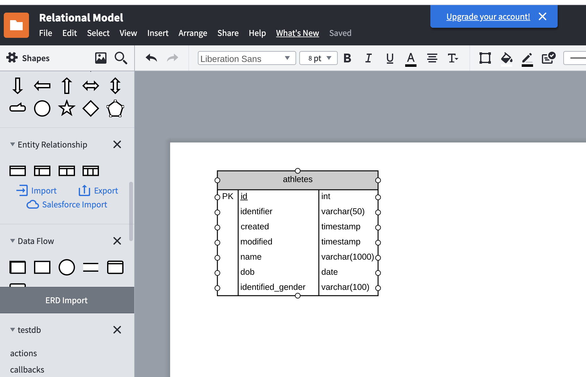
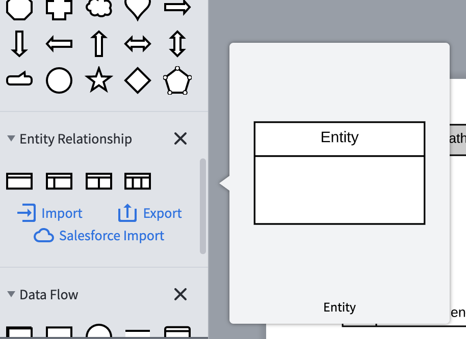
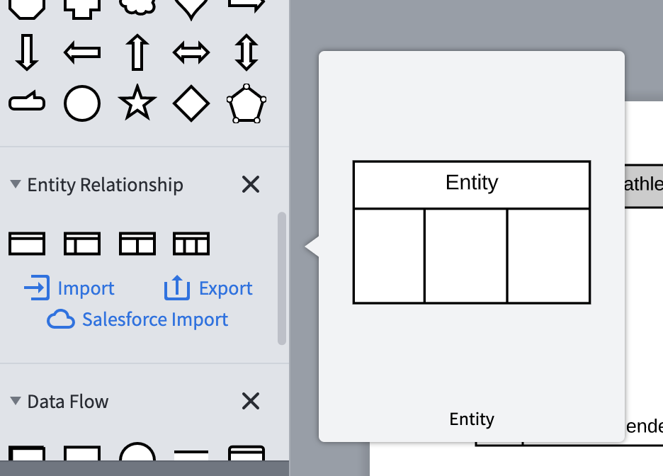
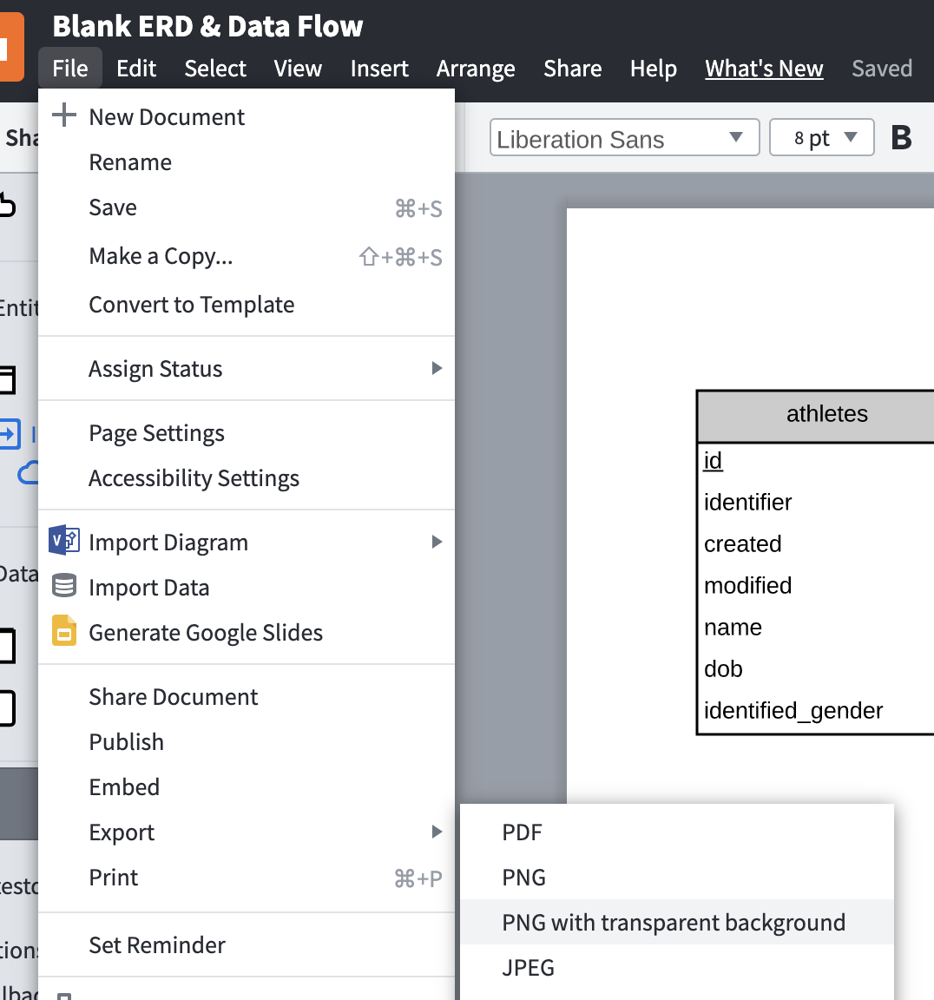

# Lucidchart

Our team is using [lucidchart](https://www.lucidchart.com)
for our diagrams.

It is free to use.

But, it only supports 3 free diagrams (we only need 2 :-).

## Generating a diagrams

From the editor, they support ERD visual elements.

The ER model is the simplified entity, and the

For the relationsl model, we choose the more complex,
three column view.

## Exporting to PNG

To incorporate into this document we exported as PNG.

